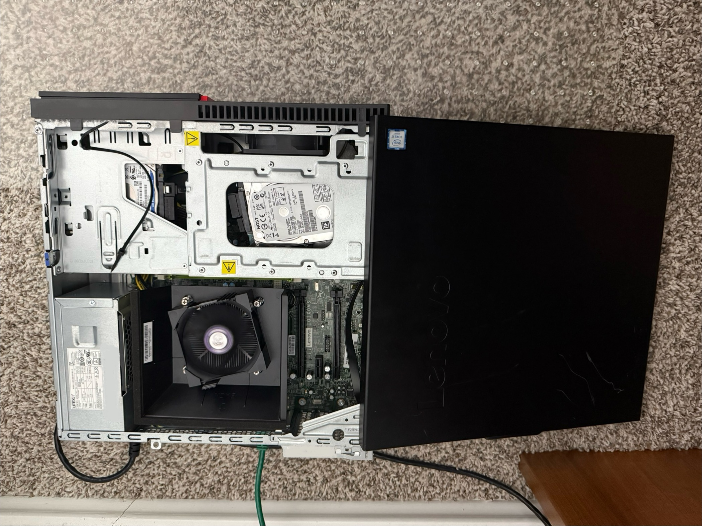
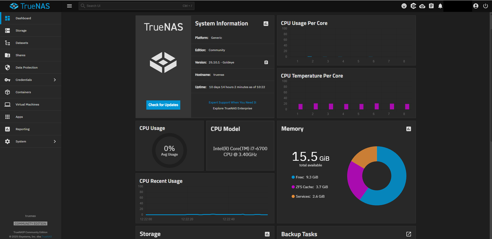

Most of what I do professionally lives above the operating system. This project is the opposite: taking a retired Lenovo ThinkCentre and turning it into a real, self-hosted NAS so I could get my hands dirty with the storage and networking layers directly.

The whole thing is documented in the [GitHub repo](https://github.com/fshah2/homelab-DIY-NAS), hardware photos and all.

## The hardware

The box is a **Lenovo ThinkCentre M800 SFF** with a 6th-gen Core i7 and 16 GB of DDR4, exactly the kind of enterprise machine that gets retired in bulk and sold cheap. A 500 GB drive holds the OS, and a 2 TB laptop HDD makes up the storage pool. Reusing hardware instead of buying a purpose-built appliance was the point: it keeps the cost near zero and forces you to actually understand what you're running.

*Inside the chassis: the OS boot drive, the storage HDD, and the DDR4 modules in the compact SFF layout.*

## The software stack

The system runs **TrueNAS SCALE**, a Linux-based storage OS, on top of **ZFS**. ZFS is the reason to do this at all, checksummed data integrity, snapshots, and a real volume manager, and configuring a pool by hand is the fastest way to internalize how it works.

- **ZFS pool** for the storage layer, currently a single disk
- **SMB shares** with role-based access control for network file sharing
- **Docker / Kubernetes workloads** through TrueNAS Apps for self-hosted services

*The TrueNAS SCALE dashboard: system health, per-core CPU load and temps, memory usage with the ZFS cache broken out, and the storage pool at a glance.*

## Secure remote access

The part I care most about is that the NAS is reachable from anywhere without exposing a single public port. Instead of port-forwarding, it joins a **Tailscale** mesh VPN, so access is identity-based: only my authenticated devices can reach it, and the storage never sits on the open internet. That's a much saner security model than punching holes in a home router.

## An honest constraint

The current pool is a single disk, which means no redundancy. That's a deliberate, clearly-stated tradeoff for a v1 learning build, not an oversight, and calling it out matters. The planned next step is moving to a mirrored or RAIDZ pool so the data can survive a drive failure.

## Why build it

A NAS you assembled and configured yourself teaches things a managed service never will: how ZFS lays out data, how SMB permissions actually resolve, and what secure remote access looks like when you can't lean on a cloud provider's defaults. It's a working piece of infrastructure and a standing excuse to keep learning the layer underneath the apps I build.
